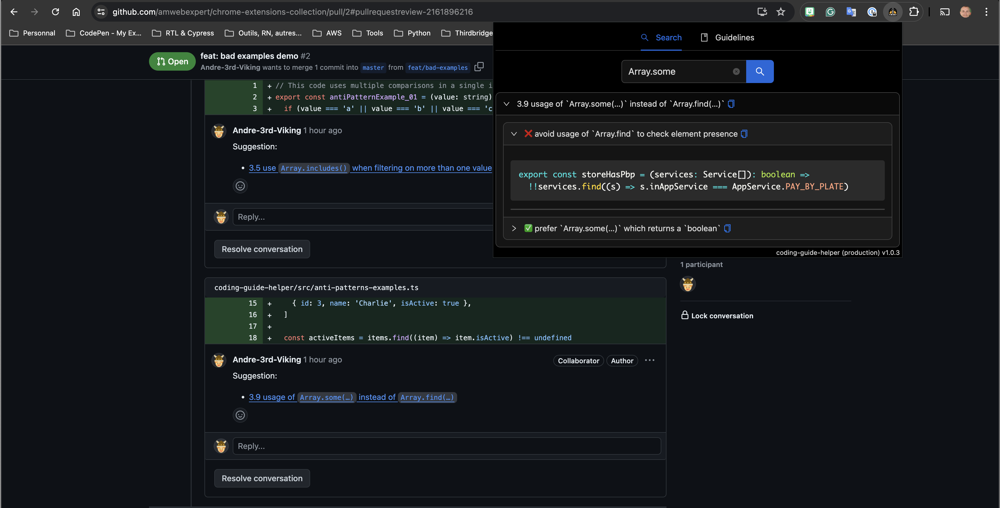

# coding-guide-helper

Coding guide helper is a chrome extension to help doing pull requests review process or just to easily browse your coding standards

This open-source Chrome extension is designed to help the development workflow. This tool allows you to seamlessly integrate your project's development guide and recommended practices directly into your browser, making it easier than ever to maintain high standards and avoid common pitfalls.

## Features:

- **Markdown File Integration**: Specify the location of your markdown files that define your project's development guide and best practices.
- **Easy Navigation**: Once configured, navigate effortlessly through the guide. Click on various links to explore anti-patterns and recommended practices in detail.
- **Keyword Filtering**: Filter the guide by keywords to quickly find the best practices relevant to your current task.
- **One-Click Copy**: Clicking on a link within the guide copies the relevant information to your clipboard instantly.
- **Streamlined Pull Request Reviews**: In review mode, if you're inside a text input for a comment, clicking on a link automatically inserts the correct explanation and best practice link into your comment, making the review process smoother and more efficient.

## Why

Keeping up with best practices and avoiding anti-patterns can be challenging, especially in complex projects. This extension ensures that your development guide is always at your fingertips, helping you and your team stay on track with minimal effort.

Download (or install it from this current project) the extension today and take the first step towards a more efficient and consistent development process.

## Installing from source

Instructions to install the Chrome extension from the source.

- cd `coding-guide-helper`
- `yarn install`
- `yarn build`
- from Google Chrome, install the extension from the generated `coding-guide-helper/dist` folder.
