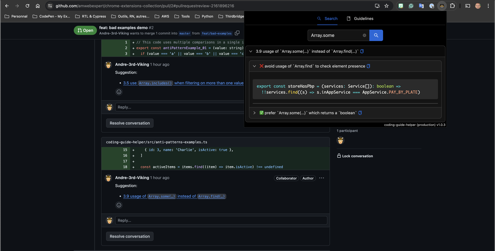

# coding-guide-helper

Coding guide helper is a [chrome extension](https://chromewebstore.google.com/detail/coding-guide-helper/opjhdjilkonehogiaakbaefekmjpgjna) to help doing pull requests review process or just to easily browse your coding standards.

This open-source Chrome extension is designed to help the development workflow. This tool allows you to seamlessly integrate your project's development guide and recommended practices directly into your browser, making it easier than ever to maintain high standards and avoid common pitfalls.

## Features:

- **Markdown File Integration**: Specify the location of your markdown files that define your project's development guide and best practices.
- **Easy Navigation**: Once configured, navigate effortlessly through the guide. Click on various links to explore anti-patterns and recommended practices in detail.
- **Keyword Filtering**: Filter the guide by keywords to quickly find the best practices relevant to your current task.
- **One-Click Copy**: Clicking on a link within the guide copies the relevant information to your clipboard instantly.
- **Streamlined Pull Request Reviews**: In review mode, if you're inside a text input for a comment, clicking on a link automatically inserts the correct explanation and best practice link into your comment, making the review process smoother and more efficient.

## Built-In Rules and Customization

Our tool comes preloaded with rules applicable to **Typescript**, **React**, and **Testing-Library**. These default rules ensure that you have a solid foundation to start with. However, we understand that every project and company has its unique standards. 

- **Custom Standards**: Each company can easily reinforce its own rules and point to its specific standards in markdown format, using the `avoid` and `prefer` approach.
- **Community Contributions**: Any developer interested in adding rules can simply submit pull requests to add new markdown files or enhance the existing ones. This collaborative approach ensures that the tool evolves with the community's needs.

## Why

Keeping up with best practices and avoiding anti-patterns can be challenging, especially in complex projects. This extension ensures that your development guide is always at your fingertips, helping you and your team stay on track with minimal effort.

Download (or install it from this current project) the extension today and take the first step towards a more efficient and consistent development process.

## Installing from source

Instructions to install the Chrome extension from the source.

- `cd coding-guide-helper`
- `yarn install`
- `yarn build`
- from Google Chrome, install the extension from the generated `coding-guide-helper/dist` folder.

## TODOs

- cache markdown files retrieval http requests results (see `collectOnlineGuidelines` fetcher perhaps `axios` cache interceptor?)
- add option to remove that cache from within options page
- add classic hyperlink icon (beside the clipboard icon) to open a browser tab with the given link
- add UI feedbacks for the "options" validations
  - test the provided links (try to fetch)
  - add a ✅ for success and a ❌ for Http 404
- add a wider search filter inside the TOC Tab
- add a review tools TAB
  - toggle all viewed files On/Off (`document.querySelectorAll('input[type=checkbox][name=viewed]').forEach(e => e.checked = false)`)
  - toggle all panels `document.querySelectorAll('[aria-label="Toggle diff contents"]').forEach(e => e.click())`
  - any other ideas welcome
- add a reset button for the default original guidelines
- manage a list of stored guidelines specifications

## Chrome AI Gemini Nano work

### AI Assistant installation

- https://huggingface.co/blog/Xenova/run-gemini-nano-in-your-browser

### Next possible optimizations

- load guidelines from cache
- usage of `systemPrompt` like: `ai.languageModel.create({ systemPrompt: "...instruction here..." })`
- provide up to 3 rules for each prompt (instead of just 1)
- instead of calling `.destroy()` we could keep a ref to the current session and use `.clone()` before next prompt
  - `const freshSession = await session.clone()` // may not be available (see below)
  - `TypeError: window.ai.assistant.clone is not a function`
- https://github.com/explainers-by-googlers/prompt-api/

## References

- [yarn-workspaces-cheat-sheet](https://github.com/isthatcentered/yarn-workspaces-cheat-sheet)
- [Transformers.js - Sample browser extension](https://github.com/huggingface/transformers.js/blob/main/examples/extension/README.md)

## TODOs

- Ticket-001:
  - Once ONNX runtime is no longer relaying on URL.createObjectURL we should start using multi-threading on worker
  - see https://github.com/microsoft/onnxruntime/issues/14445 for more information.